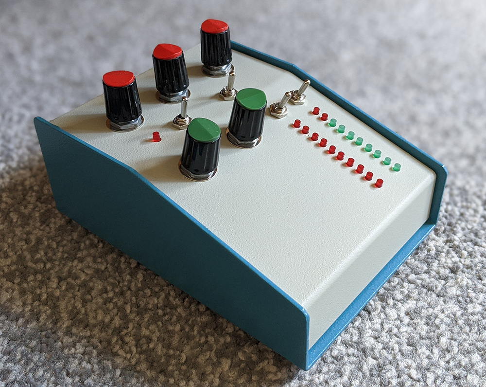

# Compressor
A high-performance VCA-based dynamic range compressor that offers control over attack, release, threshold, gain reduction, and output level.  Two 10-stage LED meters indicate gain reduction level and output level, with a separate LED indicating whether the current audio input level exceeds the chosen threshold.  All LEDs are switched and can be turned off to aid objective listening or reduce power consumption, and the audio path can be bypassed to compare processed and unprocessed audio.

[Circuit schematic for this project](Schematic/VCA_Compressor_Schematic.pdf)

[Audio files demonstrating the sound of this compressor](Audio Demos)
